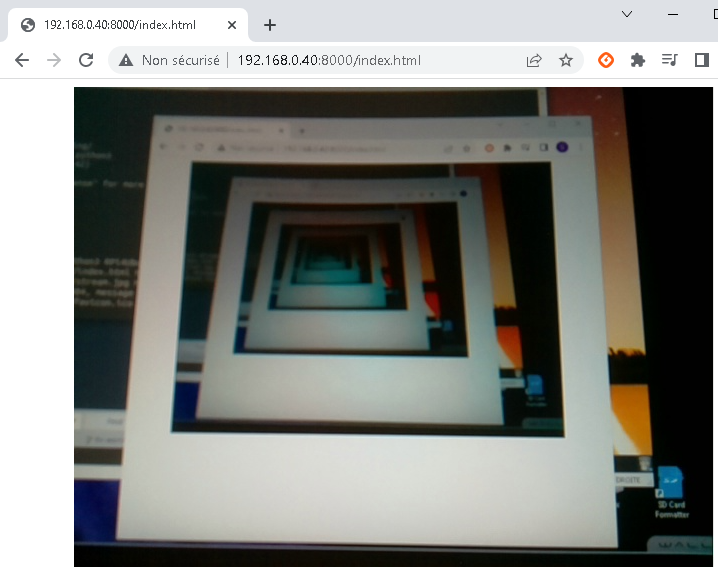

Found no out of the box script/binary to stream a regular Raspberry Pi camera, out of my Raspberry Pi 4 running Ubuntu, to get it displayed on a remote PC.

As getting it work required some efforts, I am sharing here my working solution based on Python and OpenCV.

## Environment

- Tested only on Raspberry Pi 4 Model B Rev 1.4,
- Tested only on Ubuntu Mate 20.04.3 LTS (a.k.a. Focal Fossa),
- No guarantee this would work also on any other hardware/distro,

## How to

- Install Python's high-level file operation package: "pip3 install shutil",
- Install OpenCV's Python package: "pip3 install opencv-python",
- Check/Update /boot/firmware/config.txt to make sure the following is present:
    - start_x=1
    - gpu_mem=16
- In case you modified config.txt, reboot,
- Run the camera streaming script: "python3 RPi4UbuntuCameraStreaming.py"
- On the PC, launch your favorite web browser at the following address:
    - http://192.168.0.40:8000
    - You are done!... ^_^
- Notes:
    - Replace 192.168.0.40 with your own Raspberry Pi's IP or hostname,
    - Image size (default is 640x480) and port (default is 8000) can be changed in RPi4UbuntuCameraStreaming.py.

## Side notes

Couple helpful commands:
- vcgencmd get_camera
- raspistill -o test.image.jpg
- raspivid -t 10000 -o test.video.h264
- sudo apt install v4l-utils
- v4l2-ctl --list-formats

